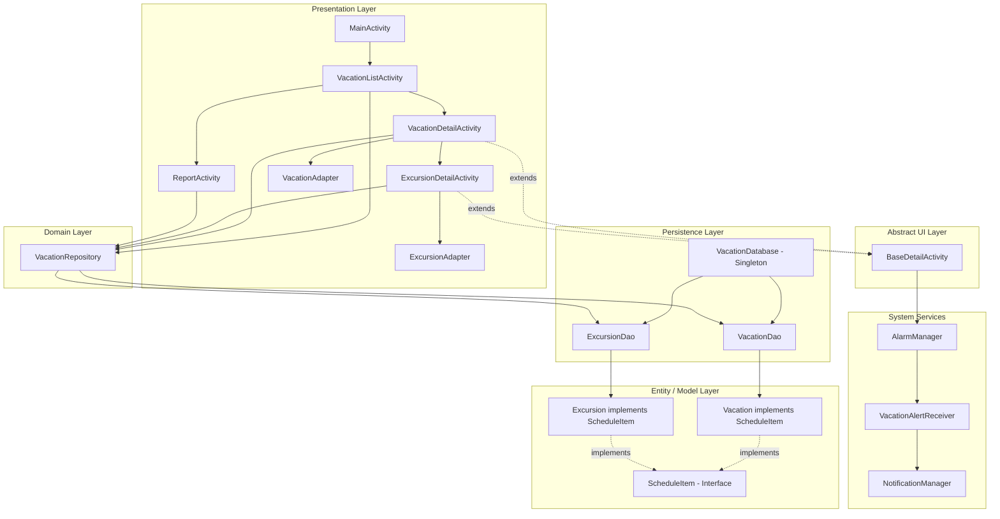
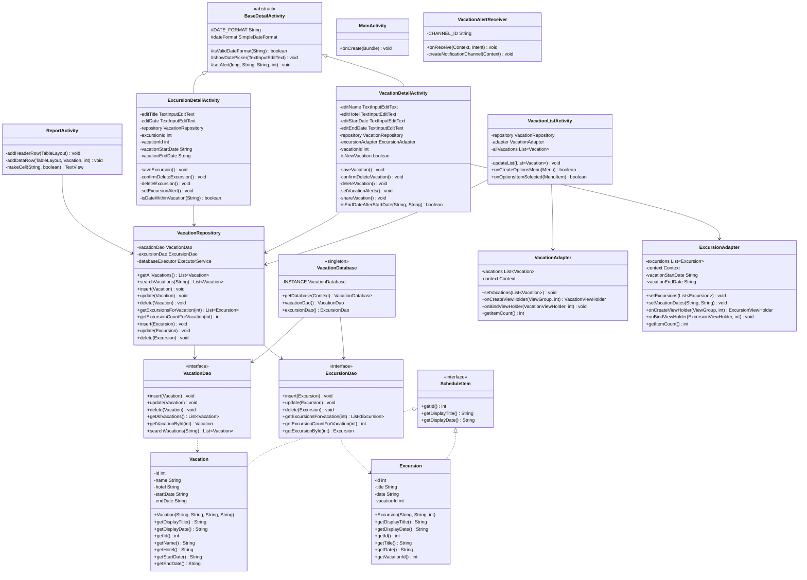

# Vacation Scheduler – Design Document

## 1. Application Overview

Vacation Scheduler is a native Android application that allows users to create, manage, and track vacations and their associated excursions. Users can set date-based alerts, share vacation details, search their vacation history, and generate a tabular report of all scheduled trips.

**Platform:** Android (API 26+)
**Language:** Java
**Architecture:** Repository Pattern with Room persistence library
**GitLab Repository:** https://gitlab.com/wgu-gitlab-environment/student-repos/NardosA/d424-software-engineering-capstone
**Branch / Commit:** `working-branch` @ `c1a022d`

---

## 2. Architecture Design Diagram



---

## 3. Class Diagram



---

## 4. Database Schema

```
vacations
┌──────────────┬──────────┬────────────────────────────────────┐
│ Column       │ Type     │ Constraints                        │
├──────────────┼──────────┼────────────────────────────────────┤
│ id           │ INTEGER  │ PRIMARY KEY AUTOINCREMENT          │
│ name         │ TEXT     │ NOT NULL                           │
│ hotel        │ TEXT     │                                    │
│ startDate    │ TEXT     │                                    │
│ endDate      │ TEXT     │                                    │
└──────────────┴──────────┴────────────────────────────────────┘

excursions
┌──────────────┬──────────┬────────────────────────────────────────────────────┐
│ Column       │ Type     │ Constraints                                        │
├──────────────┼──────────┼────────────────────────────────────────────────────┤
│ id           │ INTEGER  │ PRIMARY KEY AUTOINCREMENT                          │
│ title        │ TEXT     │ NOT NULL                                           │
│ date         │ TEXT     │                                                    │
│ vacationId   │ INTEGER  │ NOT NULL, FOREIGN KEY → vacations(id), INDEXED     │
└──────────────┴──────────┴────────────────────────────────────────────────────┘
```

---

## 5. OOP Design Decisions

| Principle | Implementation |
|---|---|
| **Encapsulation** | All entity fields (`Vacation`, `Excursion`) are `private` with public getters/setters only |
| **Inheritance** | `VacationDetailActivity` and `ExcursionDetailActivity` both extend `BaseDetailActivity`, which extends `AppCompatActivity` |
| **Polymorphism** | Both `Vacation` and `Excursion` implement the `ScheduleItem` interface; overriding `getDisplayTitle()` and `getDisplayDate()` allows uniform handling across the app |
| **Abstraction** | `BaseDetailActivity` encapsulates shared date validation, date picker, and alarm logic so subclasses inherit behavior without duplication |
| **Repository Pattern** | `VacationRepository` abstracts all database access behind a single class, making the data source swappable without changing the UI layer |
| **Singleton Pattern** | `VacationDatabase` uses double-checked locking to ensure a single Room database instance across the application lifecycle |

---

## 6. Security Features

| Feature | Implementation |
|---|---|
| SQL Injection Prevention | Room ORM uses parameterized `@Query` bindings — no raw SQL string concatenation |
| Delete Confirmation | `AlertDialog` confirmation required before any destructive delete operation |
| Input Length Validation | Vacation name and excursion title capped at 100 characters |
| Date Validation | `SimpleDateFormat.setLenient(false)` enforces strict MM/dd/yyyy parsing |
| PendingIntent Security | All `PendingIntent` objects use `FLAG_IMMUTABLE` to prevent intent hijacking |
| Component Isolation | All activities and receivers declared `android:exported="false"` except the launcher |
| Code Obfuscation | R8 minification enabled (`isMinifyEnabled = true`) with ProGuard keep rules for Room entities |

---

## 7. Scalability Design

| Element | Scalability Benefit |
|---|---|
| Room Database + DAOs | Structured SQL layer that scales to large datasets with indexing on `vacationId` |
| RecyclerView + ViewHolder | Memory-efficient list rendering — only visible items are held in memory |
| Repository Pattern | Data source can be replaced (e.g., with a remote API) without changing any Activity |
| ExecutorService Thread Pool | 4-thread pool handles concurrent database operations without blocking the UI thread |
| ScheduleItem Interface | New schedulable entity types can be added without modifying existing adapters or activities |
| Package-based structure | Clear separation of `entities`, `dao`, `database`, `adapters`, `receivers`, and `ui` packages supports team scaling |

---

## 8. Repository Link

**GitLab:** https://gitlab.com/wgu-gitlab-environment/student-repos/NardosA/d424-software-engineering-capstone
**Branch:** `working-branch`
**Submission Commit:** `c1a022d`
**Direct link to commit:** https://gitlab.com/wgu-gitlab-environment/student-repos/NardosA/d424-software-engineering-capstone/-/commit/c1a022d

> **Note:** This is a native Android mobile application and is not hosted as a web application. The link to a hosted web app is not applicable.
